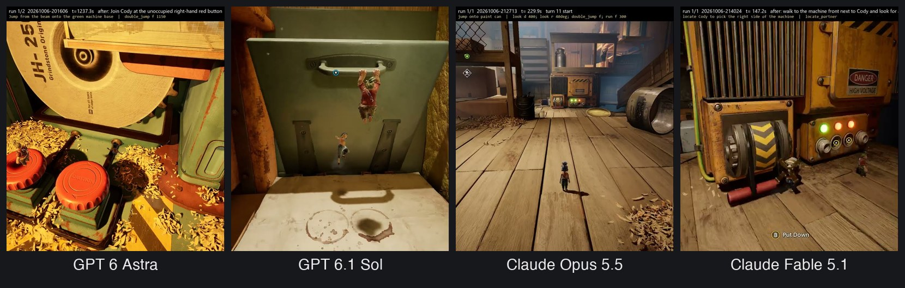

# it-takes-me

An LLM plays May in _It Takes Two_ while you play Cody. It only sees screenshots and acts through a
virtual Xbox controller.



How it works and how the models did: [write-up](https://ayushgarg.ca/notes/It-Takes-Me-10-06-2026)

## Setup

Runs on Windows with the game in borderless/windowed mode.

```bash
uv sync
```

- GPT models use your Codex login (`~/.codex/auth.json`)
- Claude models use your Claude subscription: sign in once with the `claude` CLI

## Run

```bash
uv run python pad.py    # optional: keeps one virtual controller across runs
uv run python run.py    # GPT through Codex
uv run python opus.py   # Claude through the Claude Agent SDK
```

Settings (model, effort, character, budgets) are constants at the top of `run.py` and `opus.py`. Type
in the terminal to talk to the model; `/quit` stops after the current turn.

Every session is recorded to `runs/<timestamp>/`. To replay recorded frames through a model without
the game, and compare runs:

```bash
uv run python replay.py runs/<run> --runtime codex --turns 2
uv run python summarize.py runs/<run> runs/<other-run>
```
